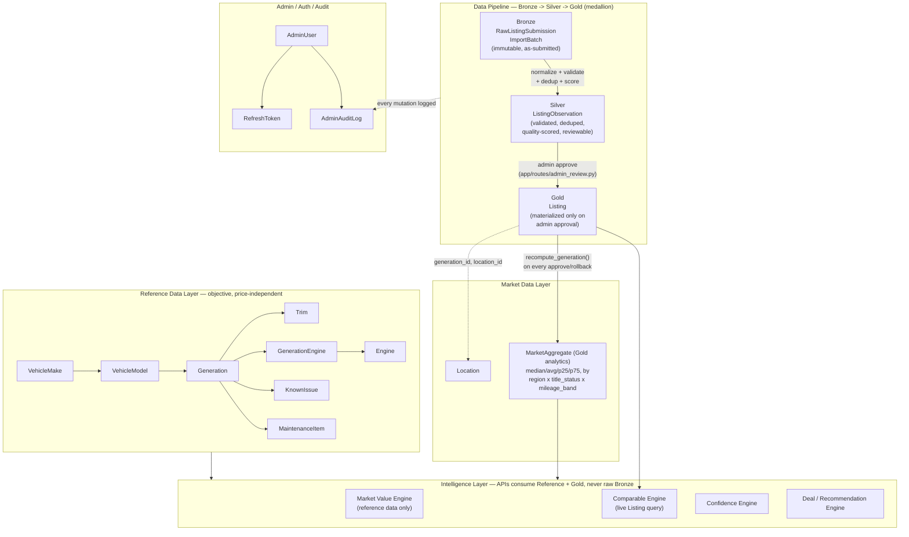
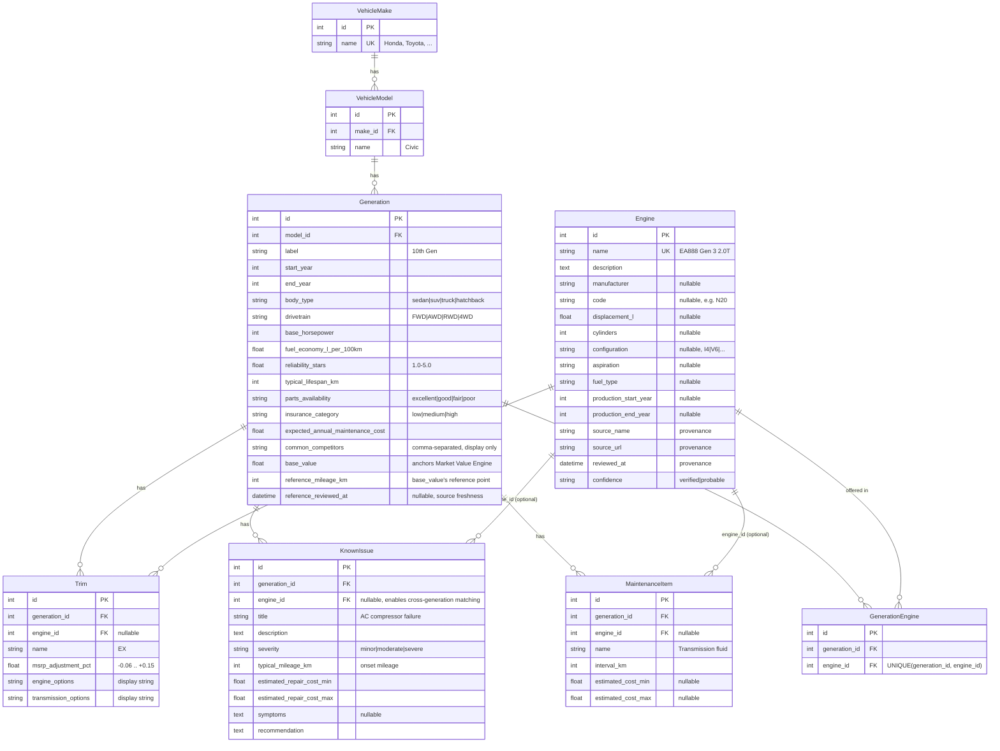
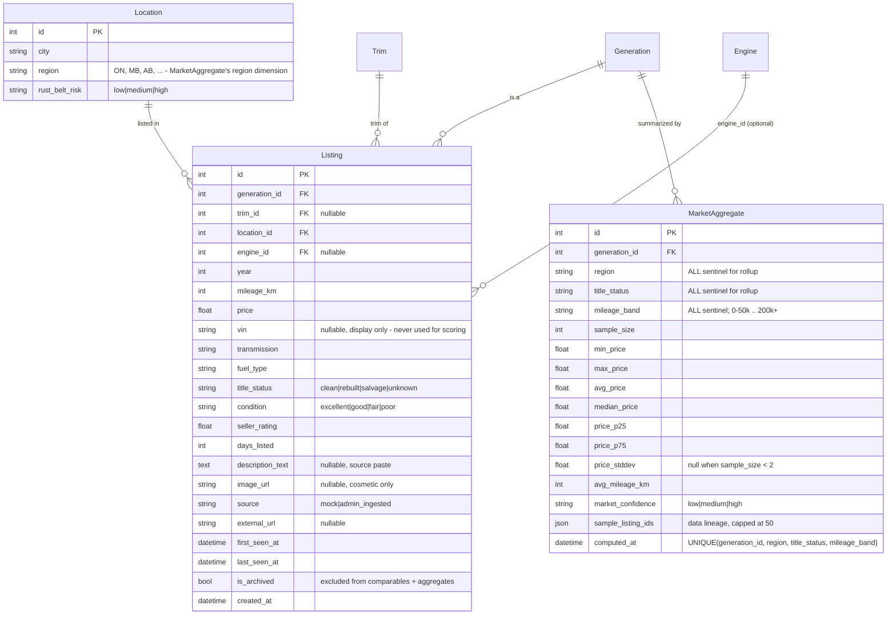
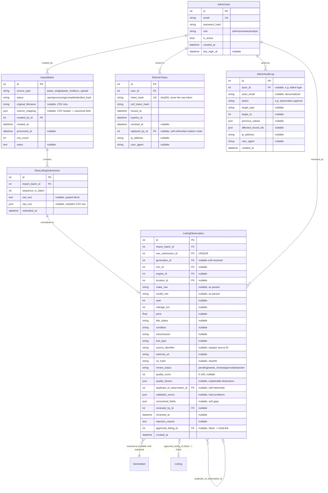

# VehicleGrade — Data Model & Architecture

This document is the entity-relationship reference for VehicleGrade's schema (19 tables, SQLAlchemy/SQLite, Postgres-compatible). It's organized around the same four layers the codebase itself is organized around — Reference Data, Market Data, Pipeline (Bronze/Silver/Gold), and Admin/Auth — because that split is the actual design decision the rest of the schema follows from, not just a documentation convenience.

For the formulas each engine runs on top of this data (Market Value, Known Issues, VehicleGrade Score, Confidence), see the [How It Works](../README.md#how-it-works) section of the main README — this document covers *what the data is*, not *what's computed from it*.

---

## 1. System architecture

**Why this shape:** the Reference layer never looks at a price, mileage reading, or seller — it's the same fact set whether the cheapest or most expensive example of a vehicle is being evaluated. The Pipeline layer is the only path by which *observed* market data (pasted listings, CSV imports) can ever influence a user-facing number, and every promotion between its three stages is either fully automatic-and-deterministic (Bronze→Silver) or requires an explicit human decision (Silver→Gold). The Intelligence layer is a pure consumer of the first two — it has no ability to write to either.

---

## 2. Reference Data Layer

Objective vehicle knowledge. Never reads price, mileage, or listing data.

**Provenance pattern:** `Engine` is the one reference table with explicit `source_name` / `source_url` / `reviewed_at` / `confidence` columns — deliberately, since engine identification is the fact most likely to be wrong if guessed, and the one other tables' `engine_id` links depend on being trustworthy. `Generation.reference_reviewed_at` exists for the same reason but isn't backfilled on every row yet (an honest, tracked gap, not a hidden one).

**Why `Engine` is separate from `Trim`:** the same engine family (e.g. Honda's L15B7) ships across multiple unrelated generations and models. Without `Engine`/`GenerationEngine` as their own tables, a known issue caused by an engine defect could only ever be entered once per generation, duplicated by hand everywhere else that engine appears — and silently miss any generation someone forgot to duplicate it into.

---

## 3. Market Data & Gold Analytics Layer

**`Listing` is the single Gold-layer fact table** two independent engines read from without ever writing to it directly:
- `market_comparables.py` queries it live, per request, for "what's similar asking right now."
- `market_aggregation.py` (`app/services/market_aggregation.py`) precomputes `MarketAggregate` from it — one row per generation × {region, title_status, mileage_band} slice actually present in the data, plus a grand-total rollup — recomputed automatically inside the same transaction as every admin approval or rollback.

**Why `region`/`title_status`/`mileage_band` use the string `"ALL"` instead of `NULL`:** SQLite (and several other engines) treat every `NULL` as distinct for uniqueness purposes, so a `UNIQUE(generation_id, region, title_status, mileage_band)` constraint couldn't actually prevent duplicate rollup rows if those columns were nullable. A named sentinel member is also the standard way an OLAP "ALL" rollup dimension is modeled, not a workaround unique to this schema.

**`is_archived`** is the one flag both live comparables and precomputed aggregates respect identically — a listing marked sold/removed (or archived by an admin rollback) disappears from both without a hard delete, since it may already be embedded in a historical report.

---

## 4. Pipeline (Bronze → Silver → Gold) & Admin/Auth Layer

**The state machine that makes "unreviewed data can never become a market estimate" an enforced invariant, not a convention:** `ListingObservation.review_status` may only be changed by `app/routes/admin_review.py`, and `approved_listing_id` is the *only* path by which a `Listing` row is ever created from ingested data. Approval is hard-blocked by any remaining `unresolved_fields`/`validation_errors`, and by an unacknowledged `duplicate_of_observation_id` (an explicit `override_duplicate: true` is required to proceed anyway).

**Dedup is three signals in priority order:** exact `source_identifier` match → exact `url_hash` match (SHA-256 of a normalized URL, extracted by regex from pasted text or supplied directly for CSV rows) → same-generation + same-year + price within ±3% + mileage within ±1500 km. It only ever *flags* via `duplicate_of_observation_id` — a human makes the final call, nothing is auto-merged or auto-discarded.

**Auth is fully separate from the ingestion state machine on purpose:** `AdminUser.role` → `ROLE_PERMISSIONS` (`admin`: all; `reviewer`: ingest/review/view; `analyst`: view-only) is checked by a single `@require_permission(...)` decorator on every mutating route, so a role's actual capabilities live in exactly one place. `RefreshToken` stores only a SHA-256 hash of the token (never the raw value) with rotation-on-use (`replaced_by_id`) so a stolen refresh token, once reused, can have its whole chain revoked.

---

## Table index

| Table | Layer | Row created by |
|---|---|---|
| `vehicle_makes`, `vehicle_models`, `generations`, `trims`, `engines`, `generation_engines`, `known_issues`, `maintenance_items` | Reference | `flask seed-db` / `flask import-reference-data` / `flask import-engine-data` |
| `locations`, `listings` | Market Data | `flask seed-db` (mock) or `app/routes/admin_review.py` approval (real) |
| `market_aggregates` | Gold Analytics | `app/services/market_aggregation.py`, on every approval/rollback + `flask seed-db` |
| `import_batches`, `raw_listing_submissions`, `listing_observations` | Pipeline (Bronze/Silver) | `app/routes/admin_ingestion.py` |
| `admin_users`, `refresh_tokens`, `admin_audit_logs` | Admin/Auth | `flask create-admin-user`, `app/routes/auth.py`, `app/services/audit_log.py` |
| `feedback`, `community_comparables` | Standalone (not yet part of the medallion pipeline — see README Future Roadmap) | `app/routes/feedback.py`, `app/routes/community.py` |
